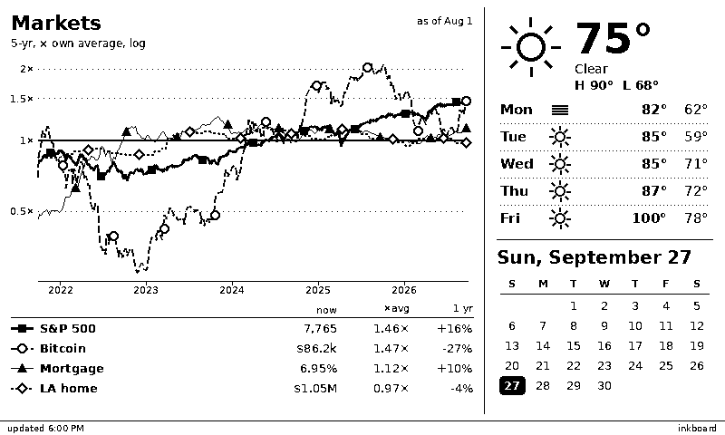

# inkboard dashboard: server-rendered widgets

**Date:** 2026-09-27 · **Status:** design approved in brainstorming, awaiting spec review
**Branch:** `feat/dashboard`

## Goal

Turn the inkboard (ESP32-C6 + 7.5" 800×480 B/W e-paper) into a household board in a
shared spot such as a kitchen or hallway. The first screen shows:

- **Market trends** (2/3 width): Bitcoin, LA median home listing price, 30-year
  mortgage rate and the S&P 500 on one chart, each normalized to its own 5-year average.
- **Calendar + weather** (1/3 width): the date, a month grid, and Los Angeles weather.

One public server, `inkboard.signalwave.dev`, serves any number of boards. Each board
chooses its own widgets, sizes, location and series in its request.



The mockup above was rendered from real data by the throwaway script
`assets/2026-09-27-dashboard-mockup.py`. It is a visual reference, not product code. The
markers on the market lines were added after this image was saved (see §5.1).

## Decisions made during brainstorming

| Topic | Decision |
|---|---|
| Rendering | **On the server.** Python + Pillow draws a 1-bit 800×480 frame. The device only downloads and displays it (TRMNL-style thin client). |
| Layout unit | Full-height **columns** of 1/3 (266 px), 2/3 (534 px) or full (800 px) width. No horizontal bands. |
| Widget selection | **By the client.** Each board sends its layout and options in the query string. The server keeps no per-device state. |
| Exposure | **Public, open service** at `inkboard.signalwave.dev` on a cloud host. No accounts. Limited per IP. |
| Market data | All from **FRED**: `SP500`, `CBBTCUSD` (Coinbase), `MORTGAGE30US`, `MEDLISPRI31080` (Realtor.com median listing price, Los Angeles CBSA). Series are selectable per board. |
| Weather | **Open-Meteo** (no key), per board location. Default is Los Angeles. |
| Calendar | Date and month grid only. No private calendar feeds. |
| Visual style | **"B" for both widgets:** the market chart has a legend table; the calendar puts weather first. |
| Power | **Battery with deep sleep.** The server says when to wake next. Every update is a full refresh. |

## 1. Architecture

```
 ┌──────────── inkboard.signalwave.dev (Docker, cloud host) ─────────────┐        ┌──── ESP32-C6 ─────┐
 │ sources/   FRED · Open-Meteo            (disk cache, TTL, stale flag) │        │ wake (RTC timer)  │
 │    ↓                                                                  │        │ Wi-Fi connect     │
 │ widgets/   MarketTrends · CalendarWeather       ← query string        │ ◀────  │ GET /v1/frame.bin │
 │    ↓                                                                  │ HTTPS  │   ?<layout>       │
 │ compositor → 800×480 1-bit → /v1/frame.bin, /v1/frame.png             │        │   If-None-Match   │
 │              ETag, X-Next-Refresh-Seconds                             │ ────▶  │ 200: full refresh │
 └───────────────────────────────────────────────────────────────────────┘        │ 304: panel idle   │
                                                                                  │ deep sleep N s    │
                                                                                  └───────────────────┘
```

The server lives in `server/` in this repo. It is a Python package managed with uv,
using FastAPI + uvicorn, Pillow and httpx, and ships as one Docker image. The firmware
stays in `src/`.

## 2. HTTP API (v1)

### 2.1 Endpoints

| Method + path | Returns |
|---|---|
| `GET /v1/frame.bin?<q>` | 48,000 bytes, `application/octet-stream`: the frame packed for the panel (§2.3). |
| `GET /v1/frame.png?<q>` | The same frame as a PNG, for previewing in a browser. It takes the same query string. |
| `GET /v1/test.bin`, `/v1/test.png` | A fixed test pattern (text, corner marks, a checkerboard) to check bit order and orientation on hardware. |
| `GET /healthz` | JSON with each source's last-success time and stale flag. 200 while the process is up. |
| `GET /` | A short HTML page listing the widgets, the series catalog and example URLs. |

### 2.2 Query string

```
/v1/frame.bin?w=market_trends:2/3,calendar_weather:1/3
             &lat=34.05&lon=-118.24&tz=America/Los_Angeles&units=imperial
             &series=sp500,btc,mortgage30,home_la&years=5
```

| Param | Meaning | Rules |
|---|---|---|
| `w` | Widgets left to right, as `type:size` | Required. The size is `1/3`, `2/3` or `1`. The thirds must add up to exactly 3. Each widget's size must be in its `supported_sizes`. |
| `tz` | IANA timezone for the clock, calendar, footer and wake schedule | Optional. Default `UTC`. It must be a valid zoneinfo name. |
| `lat`, `lon` | Weather location | Required if any widget needs a location. Must be in range. Rounded to 0.1° on the server. |
| `units` | `imperial` or `metric` | Optional. Default `imperial`. |
| `series` | Market series ids (§5.1 catalog) | Optional. Default `sp500,btc,mortgage30,home_la`. 1–4 unique ids from the catalog. |
| `years` | Market window in years | Optional. Default `5`. Allowed range 1–10. |

Parameters are flat: each widget declares which ones it reads. An unknown parameter, a
parameter no widget in `w` uses, or any rule violation returns **400** with a one-line
`text/plain` reason, for example `w: sizes add up to 4/3, need 3/3`. The server
normalizes the query (sorts params, fills in defaults) and uses the result as its
frame-cache key.

### 2.3 Frame format

- 800×480 pixels, 1 bit per pixel, rows top to bottom, most significant bit = leftmost
  pixel, 100 bytes per row. **Bit 1 = white, 0 = black.** This is what Pillow mode `"1"`
  gives from `tobytes()`.
- The firmware passes the buffer to GxEPD2 `writeImage`, with `invert` set to whatever
  the §7.3 test pattern proves correct. The server format does not change for that.

### 2.4 Response headers

| Header | Value |
|---|---|
| `ETag` | `"<sha256 of frame bytes, first 16 hex>"`. The request's `If-None-Match` is compared against it, and a match returns **304** with no body. |
| `X-Next-Refresh-Seconds` | Seconds until one minute past the next local top of the hour (so the midnight wake lands at 00:01, after the date has changed), computed in the request's `tz`. Always 300–21600. |
| `Cache-Control` | `no-cache` (the ETag drives revalidation). |
| `X-UTC-Offset-Seconds` | The request tz's current UTC offset, used for the device's offline badge time. |
| `Retry-After` | On 429 only. |

## 3. Server design

### 3.1 Package layout

```
server/
  pyproject.toml, uv.lock, Dockerfile
  inkboard_server/
    app.py            FastAPI routes, rate limit, frame cache
    query.py          parse + validate the query string → FrameRequest
    compositor.py     lay out columns, dividers, footer; per-widget error isolation
    frame.py          Pillow "L" image → threshold → 1-bit bytes / PNG; ETag
    schedule.py       next-refresh computation
    draw/             shared drawing: fonts, styled lines, markers, weather icons, text fit
    sources/
      base.py         CachedSource: TTL, disk persistence, stale flag, last-good fallback
      fred.py         FRED API (series/observations, key from env FRED_API_KEY)
      openmeteo.py    current + daily forecast per rounded location
    widgets/
      base.py         Widget ABC, Size, Box, registry
      market_trends.py
      calendar_weather.py
    series.py         market series catalog
    fonts/            DejaVu Sans (Bitstream Vera license), committed
  tests/
    fixtures/         recorded FRED + Open-Meteo responses
    goldens/          expected PNGs per widget × size
```

### 3.2 Widget base class

```python
class Size(Enum):
    THIRD = (1, 266)        # (thirds, pixel width)
    TWO_THIRDS = (2, 534)
    FULL = (3, 800)

@dataclass(frozen=True)
class Box:
    x: int; y: int; w: int; h: int     # widgets get h = 464 (480 minus a 16 px footer)

class Widget(ABC):
    type_name: ClassVar[str]                 # "market_trends", used in w=
    supported_sizes: ClassVar[frozenset[Size]]
    params: ClassVar[dict[str, ParamSpec]]   # the query params this widget reads, with defaults + validators

    def __init__(self, size: Size, options: dict[str, Any]): ...

    @abstractmethod
    def fetch(self, sources: Sources) -> WidgetData: ...
        # Reads through cached sources. Returns data plus the stale flag and as-of dates.

    @abstractmethod
    def render(self, img: Image.Image, box: Box, data: WidgetData, now: datetime) -> None: ...
        # Draws into box on an "L"-mode image. Pure: no I/O.

    def attributions(self) -> list[str]: ...  # e.g. ["FRED", "Coinbase"], for the footer
```

- Subclasses register with a class decorator: `@register`.
- The registry maps `type_name` to the class and is the only thing `query.py` consults.
- `fetch` and `render` are separate so tests can render golden images from fixture data
  with a fixed `now`, with no network.
- Adding a widget means adding one module, with no changes to the core.

### 3.3 Compositor

- It places the widgets left to right at x = 0, 266 or 534, according to their sizes.
- It draws a 1 px vertical divider between columns (inset 8 px top and bottom), then
  draws the footer strip (y 464–480, with a 1 px rule on top):
  - **left:** `updated h:mm AM`, plus `⚠ stale` if any widget's data is stale.
    The time is the most recent successful source fetch among the visible widgets, in
    the request tz, **not** the request time. It must not be the request time: then every
    frame would differ, the ETag would change on every request, and a 304 could never
    happen. The frame changes only when its data or the local date changes.
  - **right:** the attributions of all visible widgets, joined with ` · `.
- **Error isolation:**
  - If `fetch` raises and there is no cached data at all, the widget's column shows
    "No data yet: <source>".
  - If `render` raises, the column is cleared to white and shows "error: <type_name>".
  - Both cases log the traceback, and the frame is still served with 200.

### 3.4 Data sources and caching

- **`CachedSource`** wraps a fetch function.
  - It keeps results in memory and persists them as JSON under `$INKBOARD_CACHE_DIR`
    (a Docker volume), so a restart does not re-fetch everything.
  - **Stale-while-revalidate:**
    - An *expired* entry is returned immediately while one background refresh runs.
    - Only a key with no data waits for its fetch, and never past the request's deadline
      (10 s per request, under the board's 20 s timeout). On timeout the widget shows
      "No data yet".
    - A result is `stale=True` when the entry's last refresh failed, or when it is older
      than 2 × TTL.
  - **Caps that survive restarts:**
    - The disk cache is pruned to its cap at start-up and on every write.
    - The daily upstream budget is stored in the cache volume.
    - Failed never-cached keys are LRU-capped too.
  - Every result is a `SourceResult(data, fetched_at, stale)`. `fetched_at` is the time
    of the last *successful* fetch. These three fields are the source's **version**, and
    they are exactly what rendering can see: no other source metadata reaches a widget.
  - Concurrent requests for the same key share one in-flight fetch (tracked apart from
    cache eviction, so evicting a key mid-refresh cannot start a second fetch).
  - Upstream timeouts are 10 s.
- **FRED:**
  - Uses the official API with `FRED_API_KEY` from the environment, not the keyless
    graph CSV.
  - Series are cached 6 h and fetched for up to 10 years, so every `years` value is
    served from one cache entry.
  - At most 4 × catalog-size upstream calls every 6 h, no matter how many boards there are.
- **Open-Meteo:**
  - Cached for 30 min per `(round(lat,1), round(lon,1), units, tz)`. `tz` is part of the
    key because Open-Meteo's daily boundaries, dates and "today" high/low depend on the
    `timezone` sent upstream. Two boards at the same place in different timezones get
    separate entries.
  - LRU cap of 2,000 locations.
  - A daily global cap of 8,000 upstream calls, which keeps us under the free tier's
    10k/day for non-commercial use. Past the cap, sources serve stale data.
- **Frame cache:** an LRU of rendered frames (cap 500), keyed by
  `(normalized query, local date in the request tz, the (cache key, fetched_at, stale)
  tuple of every source the widgets used)`.
  - Rendering is a pure function of that key, which is what makes the ETag stable and a
    304 possible.
  - A source going stale, or a successful refetch (which moves `fetched_at` and so the
    footer time), always changes the key. That produces a new frame and a new ETag, so
    the stale warning can never be hidden behind a cached frame or a 304.
  - Trade-off: weather refetches every 30 min, so most hourly wakes get a 200 and a full
    refresh. The 304 path mainly saves a panel refresh when the device wakes early, for
    example after a retry, or when a board shows only market data.

### 3.5 Public-service protections

- **Rate limit:** 30 frame or PNG requests per IP per hour, as an in-process token
  bucket. Excess requests get a **429** with `Retry-After`. `/healthz` and `/` are exempt.
- **No accounts, no stored per-device data.** Logs record the path with the query
  string, but not IP addresses beyond what the rate limiter keeps in memory.
- **The query parser bounds everything:** at most 3 widgets, at most 4 series, numeric
  ranges enforced, and URLs longer than 1 KB rejected.
- **Publishing:** a Cloudflare Tunnel, the same pattern as `~/finance-ai` and
  `~/chug-a-lug`. A `cloudflared` container in the server's Compose project connects to
  Cloudflare, and the tunnel's public hostname points at `http://inkboard:8000`.
  - TLS terminates at Cloudflare's edge. No port is opened on the host, and there is no
    Cloudflare Access in front, because boards can't log in.
  - Setup and checks are in `docs/cloudflare-tunnel.md`.
- **Client IP for the rate limit:** read from the header named in
  `INKBOARD_CLIENT_IP_HEADER`, which is `CF-Connecting-IP` in production. Cloudflare
  overwrites it, while `X-Forwarded-For` can be pre-filled by clients. It falls back to
  the socket address when the variable is unset (local runs).
- **Deployment:** a server container plus a `cloudflared` container, with a cache volume.
  Secrets (`FRED_API_KEY`, `CLOUDFLARE_TUNNEL_TOKEN`) come from `server/.env`.

### 3.6 Next-refresh schedule

- `schedule.next_refresh_seconds(now_local)` returns the seconds until **one minute past
  the next local top of the hour**.
  - The minute of slack means a device clock running a little fast still wakes after
    the hour. That matters at midnight: the frame must already show the new date.
  - An earlier draft said "the next hour, or 00:01 if earlier". That was a bug: the
    next top of the hour always comes before 00:01, so the midnight branch never won.
- The result is clamped to 300–21600 s. For example, 11:58 gives 300 s, not 180 s.
- The next top of the hour is found in UTC and converted to local time. This handles
  DST days (23 or 25 hours) and zones whose offset is not a whole hour (for example
  Asia/Kolkata at +5:30).

## 4. Rendering conventions

- Widgets draw on an 8-bit `"L"` image. At the end, `frame.py` thresholds it at 140 into
  mode `"1"`. There is no dithering, so text and lines stay crisp.
- One font family is bundled: **DejaVu Sans** (regular, bold, condensed).
- Weather icons are drawn geometrically in `draw/icons.py` (sun, partly cloudy, cloud,
  fog, rain, snow, storm), scalable by radius, as in the mockup. No icon font dependency.
- WMO weather code mapping:

  | Codes | Icon and label |
  |---|---|
  | 0–1 | sun, "Clear" / "Mostly clear" |
  | 2 | partly cloudy |
  | 3 | cloud, "Overcast" |
  | 45, 48 | fog |
  | 51–67, 80–82 | rain |
  | 71–77, 85–86 | snow |
  | 95–99 | storm |
  | anything else | cloud, "—" |

## 5. Widgets

### 5.1 `market_trends`

**Supported sizes:** 1/3, 2/3, full. **Params:** `series`, `years`.

**Series catalog (`series.py`).** Each entry has a FRED id, a label, a short label, and
a value formatter.

| id | FRED | Label / short | Format | Attribution |
|---|---|---|---|---|
| `sp500` | `SP500` | S&P 500 / S&P | `7,765` | FRED · S&P DJI |
| `btc` | `CBBTCUSD` | Bitcoin / BTC | `$86.2k` | FRED · Coinbase |
| `mortgage30` | `MORTGAGE30US` | Mortgage / Mort | `6.95%` | FRED · Freddie Mac |
| `home_la` | `MEDLISPRI31080` | LA home / Home | `$1.05M` | FRED · Realtor.com |
| `ust10y` | `DGS10` | 10-yr Treasury / 10y | `4.12%` | FRED |
| `usd_broad` | `DTWEXBGS` | Dollar index / USD | `121.3` | FRED |

The default is the first four, in that order. The i-th requested series gets the i-th
visual style:

| Style | Line | Marker |
|---|---|---|
| 1 | thick solid (3 px) | filled square ■ |
| 2 | dashed (7 on, 4 off, 2 px) | open circle ○ |
| 3 | thin solid (1 px) | filled triangle ▲ |
| 4 | dotted (2 on, 3 off, 2 px) | open diamond ◇ |

**Data pipeline:**

1. **Weekly grid.** Build Sunday-anchored weekly dates covering the last `years` years,
   up to today in the request tz.
2. **Resample.** For each series, take the last observation on or before each weekly
   date (forward fill). The monthly home price therefore plots as steps.
3. **Normalize.** Divide by the series' mean over the window.
4. **Summarize.** Record the latest raw value, the ratio to the average, the change over
   1 year (the last value against the weekly point 52 weeks earlier), and the date of
   the last observation.
5. **Short history.** If a series has less history than `years` (for example
   `MEDLISPRI` starts in 2016), use the available span, label its window in the table,
   and don't fail.

**Layout (style B):**

- **Header:** "Markets" (bold 22; 18 at 1/3), then the subtitle "N-yr, × own average,
  log" (12). The top right shows `as of <Mon D>`, the oldest last-observation date
  among the series.
- **Chart:**
  - **Y-axis:** log scale, fitted to the minimum and maximum ratio padded by ±8%.
    Gridlines are dotted at each of ×0.25, ×0.5, ×1.5, ×2 and ×3 that falls in range.
    **×1 is solid, 2 px.** Labels sit at the left (`1.5×`).
  - **X-axis:** ticks at every 1 January, labeled `2024`; at 1/3 width they read `'24`.
  - **Lines:** each series is drawn in its line style.
  - **Markers:** placed every 56 px along x, and staggered per series by
    `56·(k+0.5)/n` so markers from different series don't stack. The last point always
    gets a marker.
- **Legend table** below the chart:
  - One row per series: a line sample with its marker, the label, **now** (formatted raw
    value), **×avg** and **1 yr** (signed %).
  - At 1/3 width the table uses short labels and drops the 1-yr column.
  - The chart height shrinks to fit the table: row height 22 (20 at 1/3), plus a 36 px
    header.

### 5.2 `calendar_weather`

**Supported sizes:** 1/3, 2/3, full. **Params:** `lat`, `lon`, `units` (plus the global
`tz`).

**Data:** Open-Meteo `current=temperature_2m,weather_code` and
`daily=weather_code,temperature_2m_max,temperature_2m_min`, with `forecast_days=8` (today plus up to 7 days) and
`timezone=<tz>`.

**Layout (style B, "weather-first"):**

- **1/3 (stacked, top to bottom):**
  1. **Now:** the icon (r = 34), the current temperature in bold 46 with `°`, the
     condition label, and `H 90°  L 68°`.
  2. **5-day forecast as rows:** weekday, small icon, high (bold) and low, with dotted
     separators.
  3. A rule, then the date line `Sun, September 27` (bold 20).
  4. The month grid, Sunday first, with today white on black in a rounded rectangle.
- **2/3 and full (two columns):**
  - The left column holds Now plus the forecast rows. It is 45% of the width at 2/3 and
    36% at full.
  - The right column holds the weekday (bold 18), the date (bold 26; `Sep 27, 2026` at
    2/3, `September 27, 2026` at full) and a large month grid.
  - A 1 px rule separates the columns.
  - At full width the forecast rows grow to 7 days.
- **Units:** °F for imperial, °C for metric. Temperatures are rounded to integers.

## 6. Firmware

### 6.1 Structure

- `src/main.cpp` becomes the thin client.
- The current smoke test moves to `extras/smoke/`, with a new `[env:smoke]` following the
  existing `[env:minimal]` pattern. The README quick start is updated to match.
- `include/config.h` (tracked) holds:
  - `SERVER_URL` (`https://inkboard.signalwave.dev`),
  - `FRAME_QUERY` (default: `w=market_trends:2/3,calendar_weather:1/3&lat=34.05&lon=-118.24&tz=America/Los_Angeles&units=imperial`),
  - `FALLBACK_SLEEP_S` (3600).
- `include/secrets.h` (already gitignored) holds `WIFI_SSID` and `WIFI_PASSWORD`.
  `secrets.h.example` is committed.
- TLS trusts a small CA bundle: ISRG Root X1 and X2, GTS Root R1 and R4. This is not one
  pinned root, because Cloudflare's Universal SSL certificate can come from Let's Encrypt
  or Google Trust Services and switch between them at renewal.
- **Last-good frame store:** LittleFS on the existing `spiffs` data partition of
  `min_spiffs.csv` holds `/frame.bin` (48,000 bytes) and `/etag.txt`.
  - It is written only after a 200, and only when the ETag changed: at most about 24
    writes a day, well within LittleFS wear levelling.
  - Writes go to a temp file first, then a rename, so a power cut mid-write never leaves
    a torn frame.
  - Space: the partition is 128 KB (32 × 4 KB blocks). The frame plus its temp copy use
    about 24 blocks, which fits. Nothing else may be stored there.
  - Flash survives deep sleep and power loss; RTC memory and the controller's RAM do not.
    The stored frame is the only copy of what the panel shows.

### 6.2 Wake cycle

RTC memory (`RTC_DATA_ATTR`) holds: `fail_count`, `showing_badge`, `showing_error`,
`last_ok_epoch`, `slept_s`. The ETag is read from `/etag.txt`, so a power cycle doesn't
force a redundant refresh.

1. **Boot.** Enable the status LED briefly as a heartbeat.
2. **Connect to Wi-Fi.** Timeout 15 s.
3. **Fetch.** `GET SERVER_URL + "/v1/frame.bin?" + FRAME_QUERY`, with `If-None-Match: <etag>`
   when there is one. Timeout 20 s. The body streams into a static 48,000-byte buffer.
4. **Handle the response:**
   - **200 with exactly 48,000 bytes:** PWR HIGH, `display.init(…)`,
     `writeImage(buf, 0, 0, 800, 480, invert)`, `refresh(false)` (full), `hibernate()`,
     PWR LOW. Save the frame and ETag to LittleFS. Set `last_ok_epoch` from the
     response `Date` header. Reset `fail_count`, `showing_badge` and `showing_error`.
   - **304:** reset `fail_count` and update `last_ok_epoch`. If `showing_badge` or
     `showing_error` is set, redraw `/frame.bin` from flash with a full refresh (no
     refetch) and clear the flag. Otherwise leave the panel alone.
   - **400:** draw the response text (at most 256 characters) on a plain error screen
     with GxEPD2 fonts: the title "inkboard config error", the message, and
     `FRAME_QUERY`. Set `showing_error` and clear the ETag.
   - **Anything else** (no Wi-Fi, timeout, TLS error, 429, 5xx, wrong length): this is a
     failure (§6.3).
5. **Sleep.**
   - The duration is `X-Next-Refresh-Seconds`, clamped to 300–21600, or
     `FALLBACK_SLEEP_S` if the header is missing.
   - Turn Wi-Fi off, then `esp_deep_sleep`.

### 6.3 Failure handling

- Don't touch the panel. The last good image stays up with no power.
- Increment `fail_count`. The next sleep is 300 s, then 900 s, then 3600 s for the third
  failure and beyond. On a 429, `Retry-After` is used if it is longer.
- When `fail_count` reaches 3, no badge is shown yet, and `/frame.bin` exists:
  - Load the whole stored frame from flash into the buffer, and draw an "offline since
    h:mm" badge into the buffer's bottom-right footer area. The badge is a
    black-bordered white box, drawn by a small bitmap-font routine that writes into
    the 1-bit buffer.
  - Write the complete buffer to the panel with one **full** refresh. There is no
    partial write: the controller lost its RAM when the HAT was powered off, so a
    partial window would leave the rest of the panel undefined.
  - The time is `last_ok_epoch`, converted with a fixed UTC offset that the server
    sends in `X-UTC-Offset-Seconds` and is kept in RTC memory. The firmware has no tz
    database.
  - Set `showing_badge`.
- If no frame is stored (first boot while offline), show nothing new. The panel keeps
  whatever it had.

### 6.4 Deferred

- Battery voltage (GPIO0 divider not yet wired). When it is, add `&batt_mv=` to the
  query, and the server shows it in the footer.
- Wi-Fi provisioning over a captive portal.
- OTA updates.
- Changes to the regulator's quiescent current (a hardware task; see `docs/hardware.md`).

## 7. Testing

### 7.1 Server (pytest, no live network)

- **`query.py`:** valid and invalid `w` strings (sums, unknown types, unsupported sizes,
  duplicate series, more than 4 series), unknown and unused params, ranges, tz validity,
  defaults, and normalization of the cache key.
- **Market pipeline:** weekly forward-fill, window trimming, mean normalization, the
  1-yr change, short-history series, and the choice of log-tick set.
- **Drawing helpers:** marker stagger positions, the WMO mapping table, and the grid for
  months starting on each weekday.
- **`schedule.py`:**
  - The next hour.
  - The case where midnight comes first.
  - The 300 s clamp.
  - US DST spring-forward and fall-back days in America/Los_Angeles.
- **Golden images:**
  - Each widget × each size, rendered from recorded fixtures with a fixed `now` and
    compared byte-for-byte to committed PNGs in `tests/goldens/`.
  - Also the compositor's stale footer, the "No data yet" column and the widget
    error-isolation box.
  - `pytest --update-goldens` rewrites them. Diffs are reviewed like code.
- **API** (FastAPI TestClient with fake sources):
  - 200 with 48,000 bytes and headers.
  - 304 on a matching ETag.
  - **Staleness can't hide:** prime a fresh frame and record its ETag, force the TTL to
    expire, and make the source fail while returning the same last-good data. The next
    request must return 200 with a **new** ETag, and the footer must show `⚠ stale`
    (checked by rendering the footer region against a golden).
  - A successful refetch with unchanged observations still changes the ETag, because
    the footer time moved.
  - **Cross-timezone weather:** the same rounded coordinates and units with
    `tz=America/Los_Angeles` and `tz=Asia/Tokyo` produce two upstream calls and two
    cache entries. Includes a request just after local midnight in one of them.
  - 400 reasons.
  - 429 after the bucket empties.
  - `/v1/frame.png` matches the `.bin` pixels.
  - `/healthz` shape.
- **CachedSource:** TTL expiry, the stale fallback on failure, disk round-trip,
  single-flight, and the daily upstream cap.

### 7.2 Firmware

- `pio run` builds every environment (`supermini-c6`, `smoke`, `minimal`,
  `minimal-kit-pins`).
- Host-side unit tests (`pio test -e native`) for the pure logic: backoff sequence, sleep
  clamping, the wake-cycle decision table (200/304/400/failure × badge/error flags →
  actions), and the badge overlay drawing into a 1-bit buffer. These live in a
  header-only module with no Arduino dependencies.

### 7.3 Hardware checklist (`docs/dashboard-bringup.md`)

1. Point `FRAME_QUERY` at `/v1/test.bin` and confirm the orientation, the corner marks,
   and that the checkerboard isn't inverted. Set the `invert` constant accordingly.
2. First boot shows the dashboard and matches `/v1/frame.png` in a browser.
3. The next wake, with no data change, gets a 304 and the panel doesn't flash.
4. Stop the server. After three real deep-sleep cycles, with the HAT powered off in
   between, the offline badge appears **over the intact last dashboard**. Restart the
   server; the next wake removes the badge. Also power-cycle the board while offline and
   confirm the stored frame survives.
5. Set a bad `FRAME_QUERY`: the config error screen appears with the server's reason.
6. Measure deep-sleep current and awake time per cycle, and record them in
   `docs/hardware.md`.

## 8. Out of scope

- A private calendar (ICS/OAuth), Home Assistant, and other widgets. The registry makes
  them additive later.
- User accounts, API keys, and per-device storage on the server.
- Partial refresh between updates. The HAT is powered off during sleep, which clears the
  controller's memory, so partial refresh isn't possible.
- Commercial use. The service is free and non-commercial because of the Open-Meteo and
  S&P DJI terms. If that changes, revisit those terms.
- Choosing the machine that runs the stack. The Cloudflare side is documented in
  `docs/cloudflare-tunnel.md`.

## 9. Risks and open points

- **S&P 500 licensing:** default-on, with attribution. It can be removed from the
  default with a one-line change to `series.py` if S&P DJI objects. Public-domain
  alternatives (`ust10y`, `usd_broad`) are in the catalog.
- **FRED API terms:** an API key is required. Usage (a few calls every 6 h) is far below
  its limits.
- **The GxEPD2 `writeImage` bit convention** (invert or not) is settled empirically by
  §7.3 step 1, not assumed.
- **TLS on the C6** adds an estimated 1–2 s and some mA to each wake. Step 6 of §7.3
  measures it, and battery-life estimates wait for that number.
